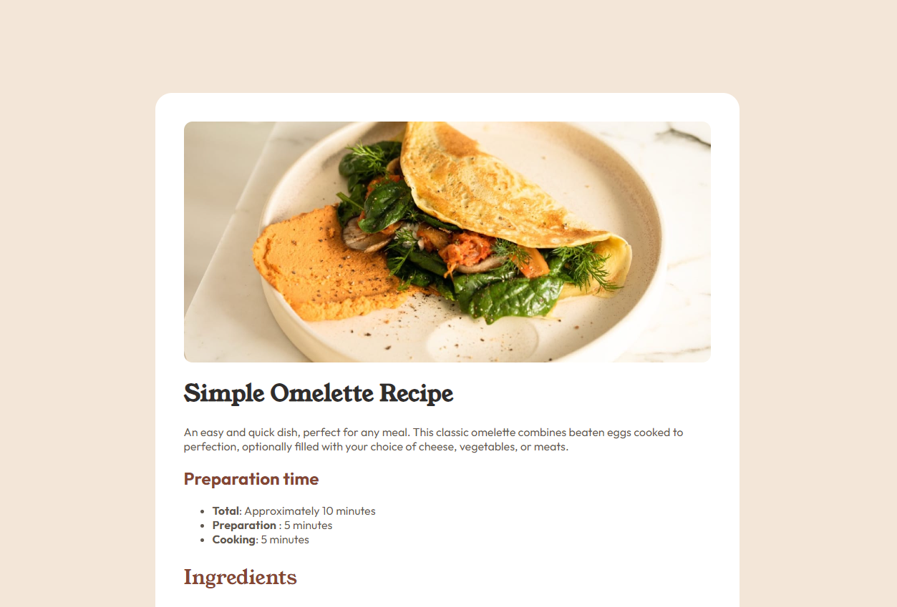

# Frontend Mentor - Recipe page solution

This is a solution to the [Recipe page challenge on Frontend Mentor](https://www.frontendmentor.io/challenges/blog-preview-card-ckPaj01IcS).

## Table of contents

- [Overview](#overview)
  - [Screenshot](#screenshot)
  - [Links](#links)
  - [Built with](#built-with)
  - [What I learned](#what-i-learned)
- [Author](#author)

## Overview

### Screenshot

### Links

- Solution URL: [View Solution](https://github.com/Esmee29/Frontend-Mentor-Recipe-Page)
- Live Site URL: [View live site](https://esmee29.github.io/Frontend-Mentor-Recipe-Page/)

## My process

### Built with

- Semantic HTML5 markup
- CSS custom properties
- Flexbox
- SASS

### What I learned

Praticed my HTML and CSS.

## Author

- Website - [Esmee Fulcher](https://esmeefulcher.co.uk/)
- Frontend Mentor - [@Esmee29](https://www.frontendmentor.io/profile/Esmee29)
